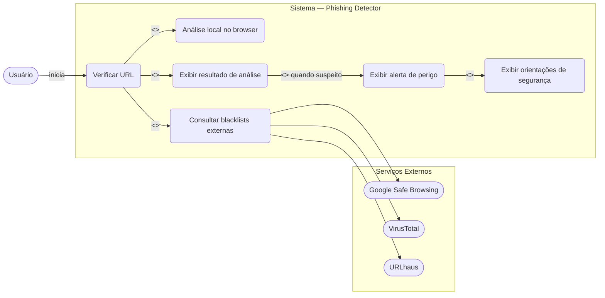
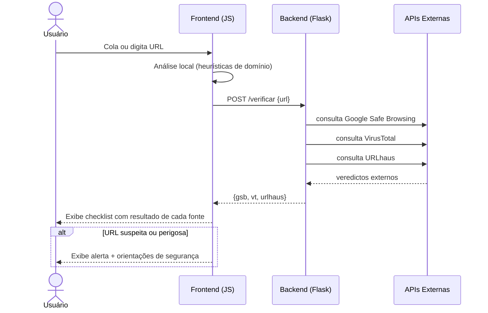
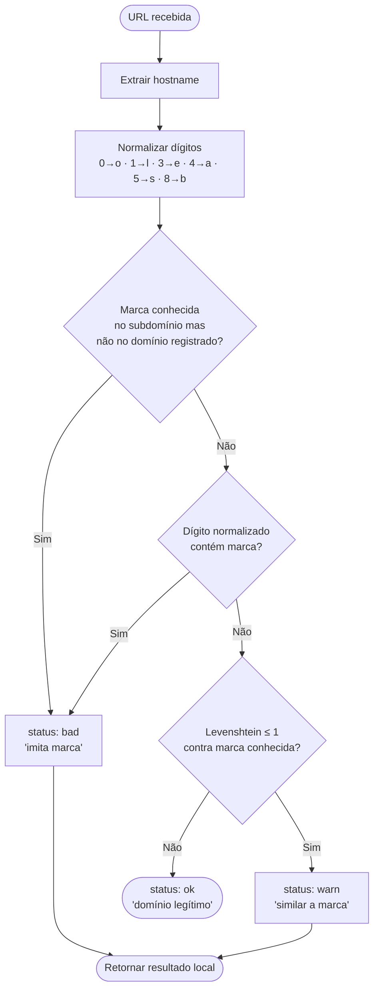
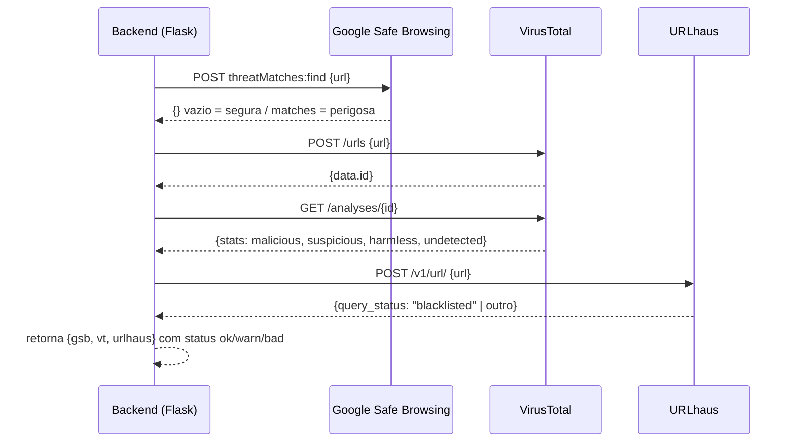
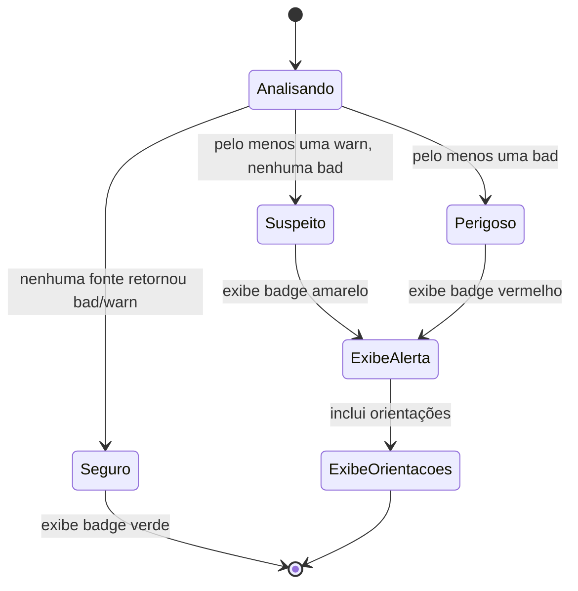
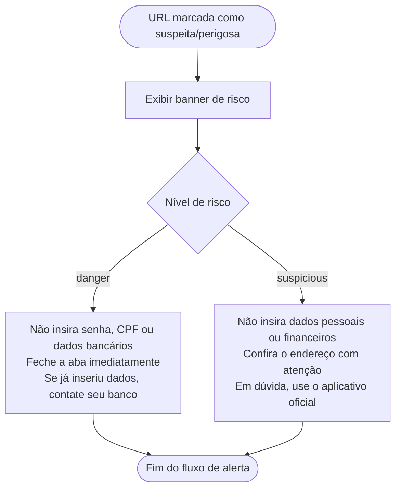

# Casos de Uso — Phishing Detector

## Diagrama Geral

---

## UC01 — Verificar URL

---

## UC02 — Análise Local no Browser

Executada em JavaScript, sem round-trip ao backend.

Marcas monitoradas: bradesco, itau, santander, caixa, bb, nubank, mercadolivre, amazon, paypal, netflix, ifood, correios.

---

## UC03 — Consultar Blacklists Externas

Sem chave configurada para GSB ou VT, o backend retorna `warn` com mensagem `'sem chave de API'`.

---

## UC04 — Exibir Resultado de Análise

Lógica de agregação (frontend):
- qualquer `bad` → **danger**
- qualquer `warn`, sem `bad` → **suspicious**
- todos `ok` → **safe**

---

## UC05 — Exibir Alerta e Orientações de Segurança

