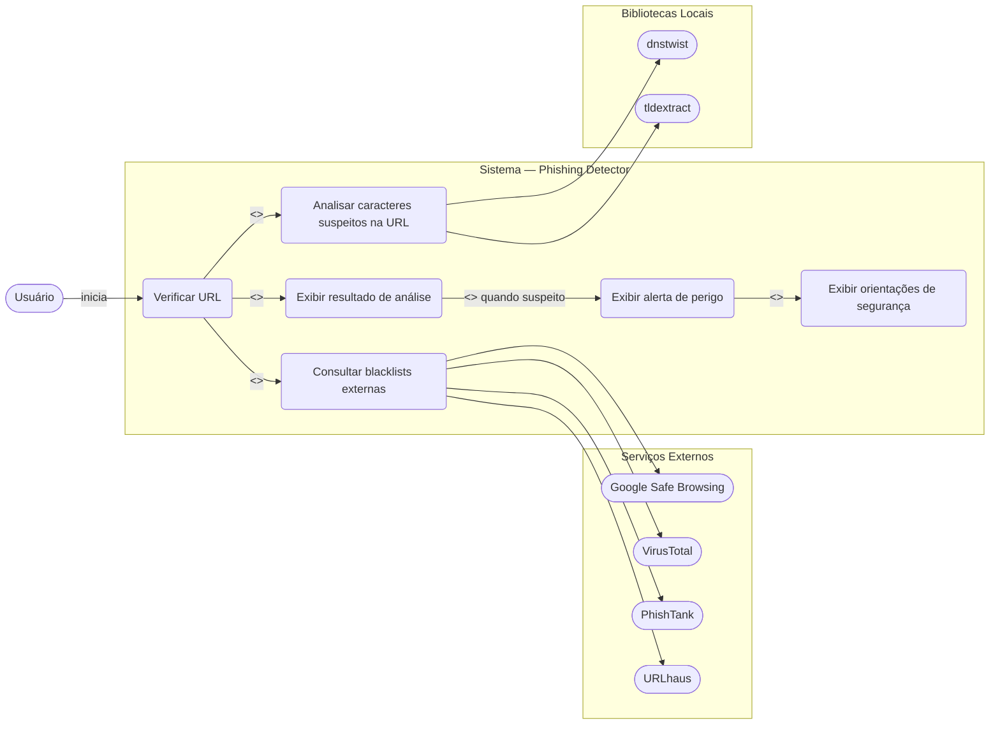
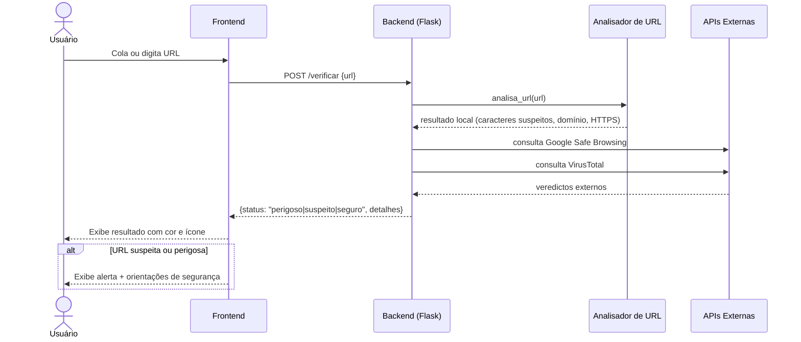
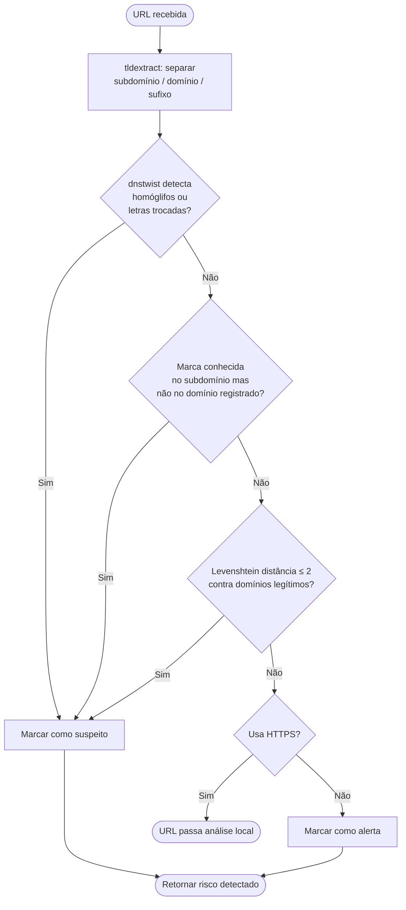
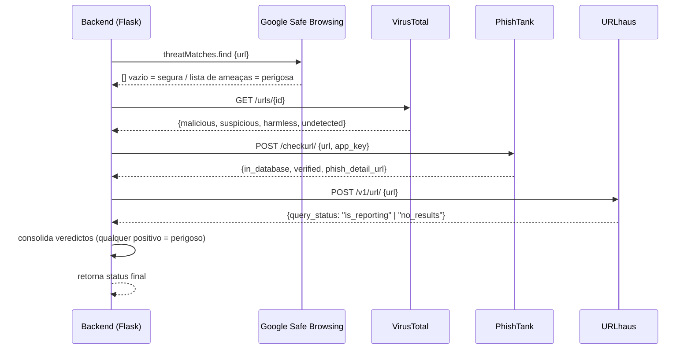
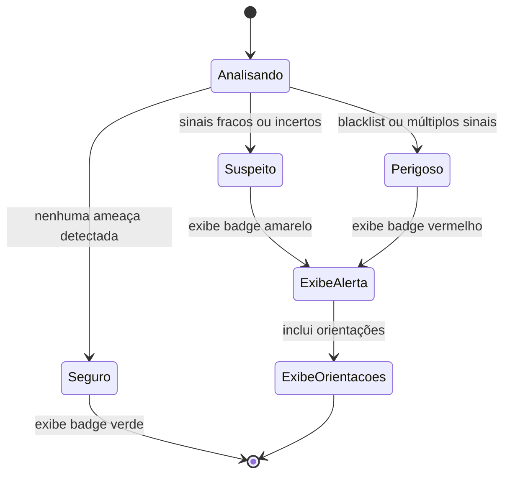
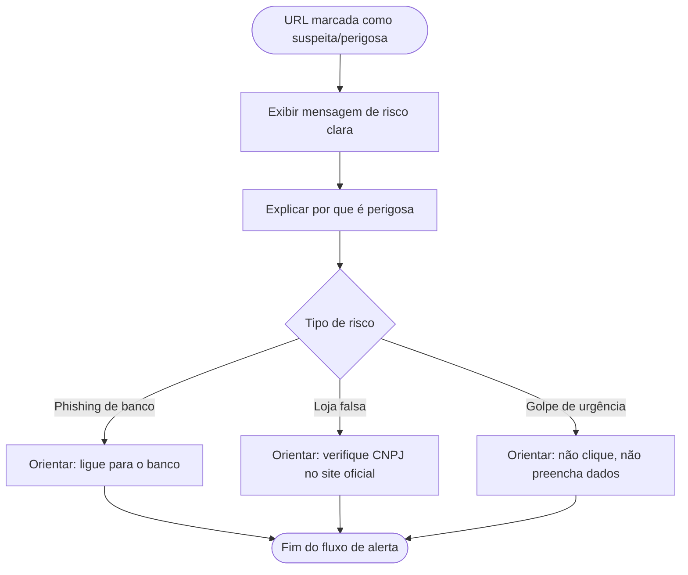

# Casos de Uso — Phishing Detector

## Diagrama Geral

---

## UC01 — Verificar URL

---

## UC02 — Analisar Caracteres Suspeitos na URL

---

## UC03 — Consultar Blacklists Externas

---

## UC04 — Exibir Resultado de Análise

---

## UC05 — Exibir Alerta e Orientações de Segurança

