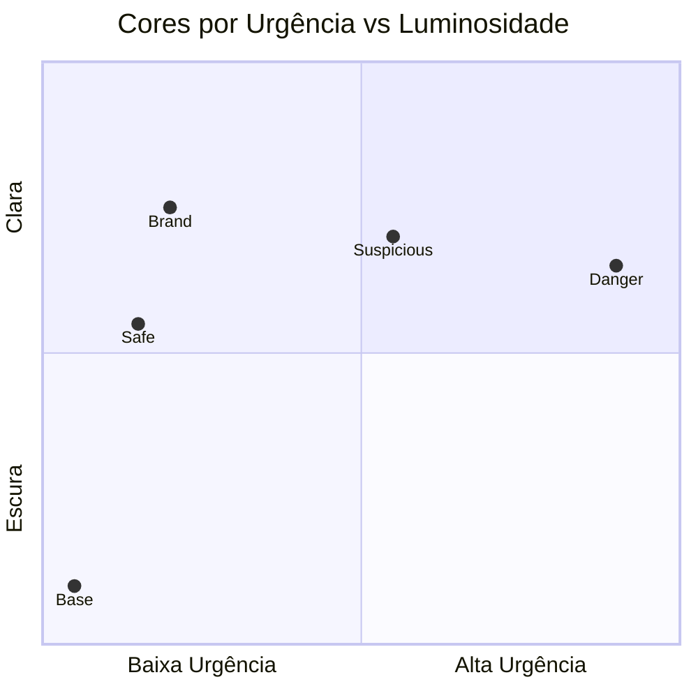
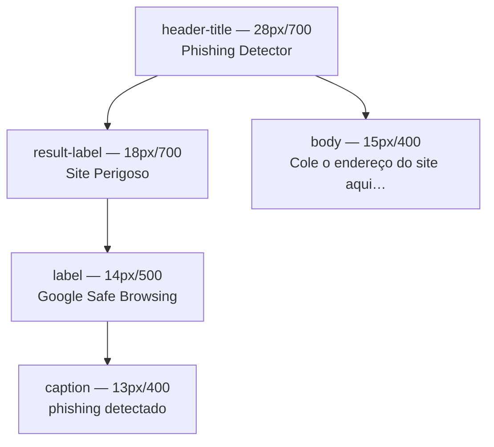
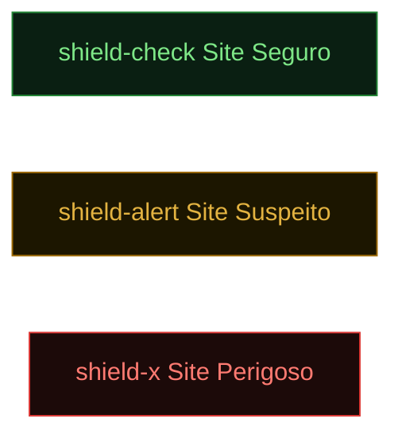
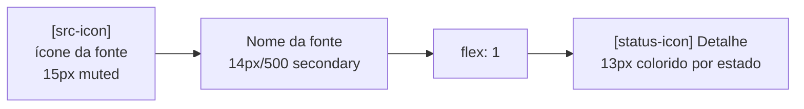
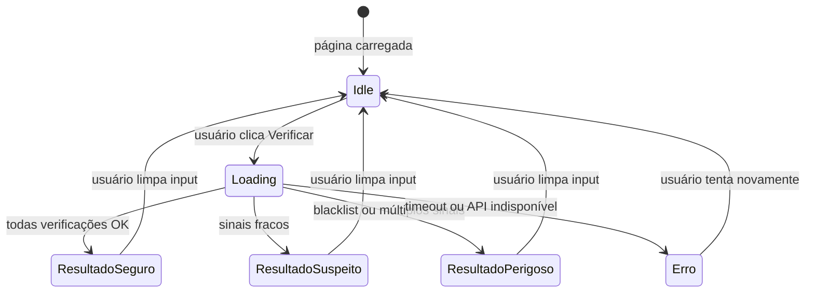
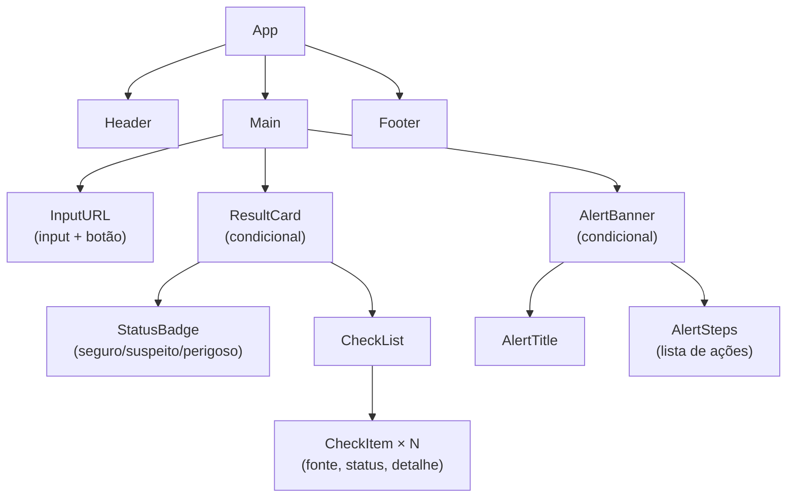

# Design System — Phishing Detector

> Princípios guia: **clareza acima de estética**, **acessível para idosos**, **feedback imediato e inequívoco**.
> Tema: **dark pastel** — fundo escuro com cores de status suaves e de alto contraste relativo.

---

## 1. Paleta de Cores

> Tema base: dark (inspirado em GitHub Dark). Cores de status em pastel sobre fundo escuro garantem legibilidade sem agressividade visual.

### Base

| Token | Hex | Uso |
|---|---|---|
| `--bg` | `#0D1117` | Fundo da página |
| `--surface` | `#161B22` | Cards, inputs |
| `--surface-2` | `#21262D` | Hover, elevated surfaces |
| `--border` | `#30363D` | Bordas principais |
| `--border-subtle` | `#1C2128` | Divisores internos de card |
| `--text-primary` | `#E6EDF3` | Títulos e corpo principal |
| `--text-secondary` | `#8B949E` | Labels, subtítulos |
| `--text-muted` | `#484F58` | Placeholders, captions |
| `--brand` | `#79C0FF` | Botão primário, foco, links |
| `--brand-dark` | `#58A6FF` | Hover do botão |

### Status (pastel sobre dark)

| Token | Hex | Uso |
|---|---|---|
| `--safe` | `#7EE787` | Texto e ícone — resultado seguro |
| `--safe-bg` | `rgba(126,231,135,0.08)` | Fundo do header do card seguro |
| `--safe-border` | `#238636` | Borda do card seguro |
| `--suspicious` | `#E3B341` | Texto e ícone — resultado suspeito |
| `--suspicious-bg` | `rgba(227,179,65,0.08)` | Fundo do header suspeito |
| `--suspicious-border` | `#9E6A03` | Borda do card suspeito |
| `--danger` | `#FF7B72` | Texto e ícone — resultado perigoso |
| `--danger-bg` | `rgba(255,123,114,0.08)` | Fundo do header perigoso |
| `--danger-border` | `#DA3633` | Borda do card perigoso |



---

## 2. Tipografia

> Font: **Inter** (Google Fonts) — fallback: `system-ui, sans-serif`
> `-webkit-font-smoothing: antialiased` obrigatório no tema escuro.

| Token | Tamanho | Peso | Uso |
|---|---|---|---|
| `header-title` | 28px / 1.75rem | 700 | Título da página, letter-spacing -0.02em |
| `result-label` | 18px / 1.125rem | 700 | Veredito do card (Site Seguro / Perigoso) |
| `body` | 15px / 0.9375rem | 400 | Corpo, subtítulo, texto do botão |
| `label` | 14px / 0.875rem | 500 | Nome das fontes na checklist, alerta |
| `caption` | 13px / 0.8125rem | 400 | Detalhe do resultado, URL no card |
| `micro` | 12px / 0.75rem | 600 | Section labels em uppercase |



---

## 3. Espaçamento e Grid

| Token | Valor | Uso |
|---|---|---|
| `--space-xs` | 4px | Gap interno mínimo |
| `--space-sm` | 8px | Gap entre ícone e label |
| `--space-md` | 16px | Padding interno de cards |
| `--space-lg` | 24px | Separação entre seções |
| `--space-xl` | 40px | Margem vertical entre blocos principais |

- Layout: **coluna única centralizada**, max-width `600px`
- Mobile-first — smartphone é o dispositivo primário do público-alvo
- Padding lateral da página: `16px` (mobile) / `24px` (desktop)

---

## 4. Componentes

### 4.1 Input de URL

```
┌─────────────────────────────────────────────────────┐
│  Cole ou digite o endereço do site aqui             │
│                                                     │
│  https://www.exemplo.com.br                    [✕]  │
└─────────────────────────────────────────────────────┘
```

| Propriedade | Valor |
|---|---|
| Altura | 56px |
| Border | 2px solid `--color-border` |
| Border (foco) | 2px solid `--color-brand` |
| Border-radius | 12px |
| Font-size | 18px |
| Placeholder | `--color-text-secondary` |
| Padding | `16px` |

---

### 4.2 Botão Primário — Verificar

```
┌──────────────────────────────┐
│        Verificar Site        │
└──────────────────────────────┘
```

| Estado | Aparência |
|---|---|
| Default | bg `--color-brand`, text branco, 18px/600 |
| Hover | bg `--color-brand-dark` |
| Loading | bg `--color-brand`, spinner animado, texto "Analisando…" |
| Disabled | bg `#CBD5E1`, cursor not-allowed |

- Altura: **56px** — área de toque grande para idosos
- Border-radius: 12px
- Width: 100% no mobile

---

### 4.3 Status do Card de Resultado

> Substituiu o badge isolado. O status é exibido diretamente no header do card com ícone Lucide + texto + URL.

| Estado | Ícone Lucide | Cor | Fundo do header |
|---|---|---|---|
| Seguro | `shield-check` | `--safe` `#7EE787` | `--safe-bg` |
| Suspeito | `shield-alert` | `--suspicious` `#E3B341` | `--suspicious-bg` |
| Perigoso | `shield-x` | `--danger` `#FF7B72` | `--danger-bg` |
| Carregando | `loader-2` (spin) | `--text-secondary` | neutro |



- Ícone em caixa 52×52px, border-radius 12px, background semi-transparente da cor do status
- Texto: 18px/700, mesma cor do status

---

### 4.4 Card de Resultado

**Estado: Seguro**
```
┌─────────────────────────────────────────────────────┐  ← borda verde
│  ✅  SEGURO                                          │
│  bradesco.com.br                                    │
│─────────────────────────────────────────────────────│
│  ✅ Google Safe Browsing       sem ameaças           │
│  ✅ VirusTotal                 0/90 engines          │
│  ✅ PhishTank                  não encontrado        │
│  ✅ URLhaus                    não encontrado        │
│  ✅ Análise de URL             domínio legítimo      │
└─────────────────────────────────────────────────────┘
```

**Estado: Perigoso**
```
┌─────────────────────────────────────────────────────┐  ← borda vermelha
│  🚨  SITE PERIGOSO                                   │
│  br4desco.com.br                                    │
│─────────────────────────────────────────────────────│
│  🚨 Google Safe Browsing       phishing detectado   │
│  🚨 VirusTotal                 12/90 engines        │
│  🚨 PhishTank                  verificado           │
│  ✅ URLhaus                    não encontrado        │
│  ⚠️  Análise de URL             "4" no lugar de "a" │
└─────────────────────────────────────────────────────┘
```

---

### 4.5 Banner de Alerta

Exibido abaixo do card quando status = Suspeito ou Perigoso.

```
┌─────────────────────────────────────────────────────┐
│  🚨  O que você deve fazer agora                    │
│─────────────────────────────────────────────────────│
│  • Não insira sua senha, CPF ou dados bancários     │
│  • Feche esta aba                                   │
│  • Se já inseriu dados, ligue para o seu banco      │
└─────────────────────────────────────────────────────┘
```

| Propriedade | Perigoso | Suspeito |
|---|---|---|
| Borda esquerda | 4px `--color-danger` | 4px `--color-suspicious` |
| Fundo | `--color-danger-bg` | `--color-suspicious-bg` |
| Ícone | 🚨 | ⚠️ |

---

### 4.6 Checklist de Verificações

> Todos os ícones são de [Lucide](https://lucide.dev) — sem emojis.



| Coluna | Ícone Lucide | Cor |
|---|---|---|
| Fonte — Google | `globe` | `--text-muted` |
| Fonte — VirusTotal | `bug` | `--text-muted` |
| Fonte — PhishTank | `fish` | `--text-muted` |
| Fonte — URLhaus | `link-2` | `--text-muted` |
| Fonte — Local | `scan` | `--text-muted` |
| Status OK | `circle-check` | `--safe` |
| Status Alerta | `triangle-alert` | `--suspicious` |
| Status Perigo | `circle-x` | `--danger` |
| Status Loading | `loader-2` (spin) | `--text-muted` |

---

## 5. Estados da Interface



---

## 6. Layout de Telas

### Tela Principal (Idle)

```
┌─────────────────────────────────────────────────────┐
│                   🔍 Phishing Detector               │  ← hero 32px
│        Verifique se um site é seguro antes           │
│              de inserir seus dados                   │  ← body 18px
│                                                     │
│  ┌───────────────────────────────────────────────┐  │
│  │  Cole o endereço do site aqui…                │  │  ← input 56px
│  └───────────────────────────────────────────────┘  │
│                                                     │
│  ┌───────────────────────────────────────────────┐  │
│  │              Verificar Site                   │  │  ← botão 56px
│  └───────────────────────────────────────────────┘  │
└─────────────────────────────────────────────────────┘
```

### Tela de Loading

```
┌─────────────────────────────────────────────────────┐
│                   🔍 Phishing Detector               │
│                                                     │
│  ┌───────────────────────────────────────────────┐  │
│  │  https://br4desco.com.br               [✕]   │  │
│  └───────────────────────────────────────────────┘  │
│                                                     │
│  ┌───────────────────────────────────────────────┐  │
│  │          ⟳  Analisando…                       │  │
│  └───────────────────────────────────────────────┘  │
│                                                     │
│  ┌───────────────────────────────────────────────┐  │
│  │  ⏳ Google Safe Browsing   verificando…       │  │
│  │  ⏳ VirusTotal             verificando…       │  │
│  │  ⏳ PhishTank              verificando…       │  │
│  │  ⏳ URLhaus                verificando…       │  │
│  │  ✅ Análise de URL         concluída          │  │
│  └───────────────────────────────────────────────┘  │
└─────────────────────────────────────────────────────┘
```

### Tela de Resultado Perigoso

```
┌─────────────────────────────────────────────────────┐
│                   🔍 Phishing Detector               │
│                                                     │
│  ┌───────────────────────────────────────────────┐  │
│  │  https://br4desco.com.br               [✕]   │  │
│  └───────────────────────────────────────────────┘  │
│                                                     │
│  ┌───────────────────────────────────────────────┐  ← borda vermelha
│  │  🚨  SITE PERIGOSO                            │
│  │  br4desco.com.br                              │
│  │───────────────────────────────────────────────│
│  │  🚨 Google Safe Browsing  phishing detectado  │
│  │  🚨 VirusTotal            12/90 engines       │
│  │  🚨 PhishTank             verificado          │
│  │  ✅ URLhaus               não encontrado      │
│  │  ⚠️  Análise de URL        "4" no lugar de "a"│
│  └───────────────────────────────────────────────┘  │
│                                                     │
│  ┌───────────────────────────────────────────────┐  ← fundo vermelho claro
│  │  🚨  O que você deve fazer agora              │
│  │  • Não insira senha, CPF ou dados bancários   │
│  │  • Feche esta aba imediatamente               │
│  │  • Se já inseriu dados, ligue para o banco    │
│  └───────────────────────────────────────────────┘  │
│                                                     │
│  ┌───────────────────────────────────────────────┐  │
│  │         Verificar outro site                  │  │
│  └───────────────────────────────────────────────┘  │
└─────────────────────────────────────────────────────┘
```

---

## 7. Hierarquia de Componentes



---

## 8. Tokens CSS

> Tema dark pastel. Carregar **Inter** via Google Fonts e **Lucide** via unpkg antes de usar.

```css
:root {
  /* Base */
  --bg:            #0D1117;
  --surface:       #161B22;
  --surface-2:     #21262D;
  --border:        #30363D;
  --border-subtle: #1C2128;

  /* Text */
  --text-primary:   #E6EDF3;
  --text-secondary: #8B949E;
  --text-muted:     #484F58;

  /* Brand */
  --brand:      #79C0FF;
  --brand-dark: #58A6FF;

  /* Safe */
  --safe:        #7EE787;
  --safe-bg:     rgba(126, 231, 135, 0.08);
  --safe-border: #238636;
  --safe-glow:   rgba(126, 231, 135, 0.12);

  /* Suspicious */
  --suspicious:        #E3B341;
  --suspicious-bg:     rgba(227, 179, 65, 0.08);
  --suspicious-border: #9E6A03;
  --suspicious-glow:   rgba(227, 179, 65, 0.12);

  /* Danger */
  --danger:        #FF7B72;
  --danger-bg:     rgba(255, 123, 114, 0.08);
  --danger-border: #DA3633;
  --danger-glow:   rgba(255, 123, 114, 0.12);

  /* Tipografia */
  --font:    'Inter', system-ui, sans-serif;

  /* Espaçamento */
  --xs: 4px;
  --sm: 8px;
  --md: 16px;
  --lg: 24px;
  --xl: 40px;

  /* Forma */
  --r-sm: 8px;
  --r-md: 12px;
  --r-lg: 16px;
  --input-h: 52px;
}
```

### Dependência de ícones

```html
<!-- Lucide (ícones SVG, ~50KB gzipped) -->
<script src="https://unpkg.com/lucide@latest"></script>
```

Uso em HTML: `<i data-lucide="shield-check"></i>`
Inicialização: `lucide.createIcons()` — chamar após inserir novos ícones no DOM.
