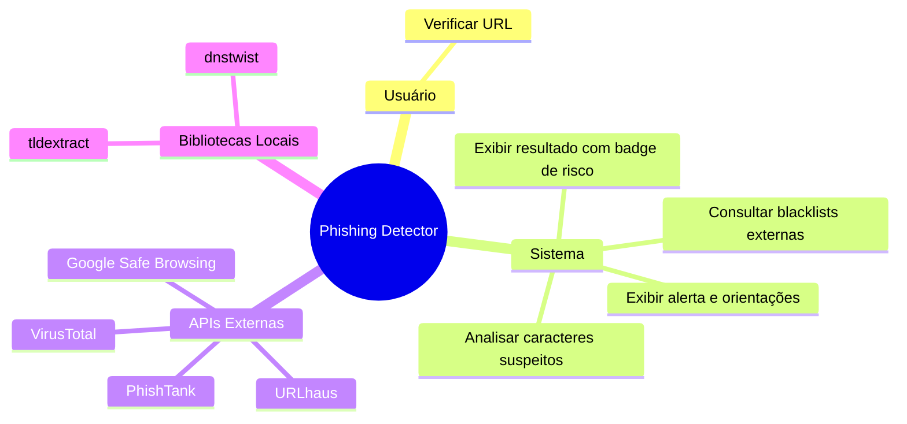
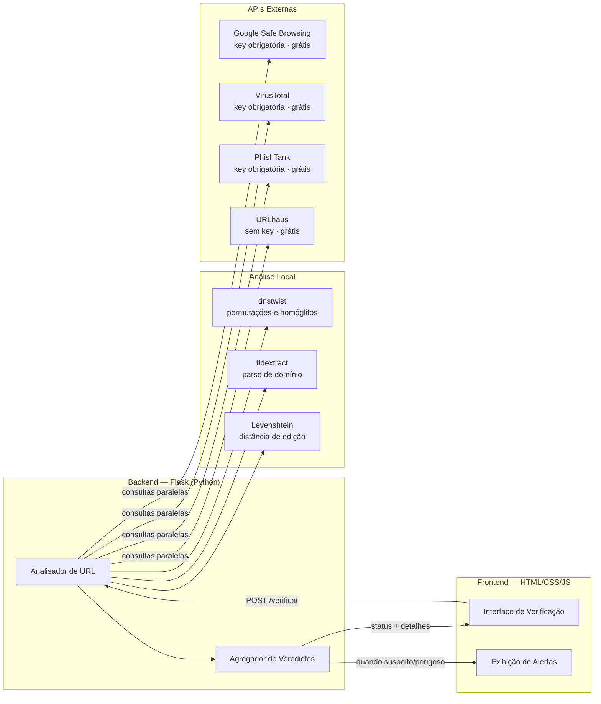

# Phishing Detector

Sistema web para verificação de URLs suspeitas, com análise local e consulta a múltiplas blacklists externas.

---

## Visão Geral



---

## Arquitetura



---

## Dependências Python

| Pacote | Uso |
|---|---|
| `flask` | framework web |
| `dnstwist` | detecção de domínios parecidos e homóglifos |
| `tldextract` | parse de subdomínio / domínio / sufixo |
| `python-Levenshtein` | distância de edição entre domínios |
| `requests` | chamadas às APIs externas |

```
pip install flask dnstwist tldextract python-Levenshtein requests
```

---

## APIs Externas

| API | Endpoint principal | Autenticação |
|---|---|---|
| Google Safe Browsing | `POST /v4/threatMatches:find` | API key (Google Cloud) |
| VirusTotal | `GET /api/v3/urls/{id}` | API key (VirusTotal) |
| PhishTank | `POST https://checkurl.phishtank.com/checkurl/` | API key (PhishTank) |
| URLhaus | `POST https://urlhaus-api.abuse.ch/v1/url/` | Sem autenticação |

---

## Documentação

| Arquivo | Conteúdo |
|---|---|
| `casos-de-uso.md` | Diagramas de casos de uso (UC01–UC05) |
| `design-system.md` | Paleta, tipografia, componentes e wireframes |
