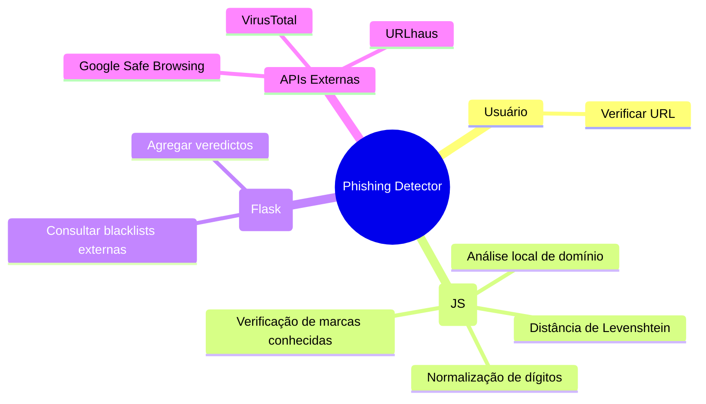
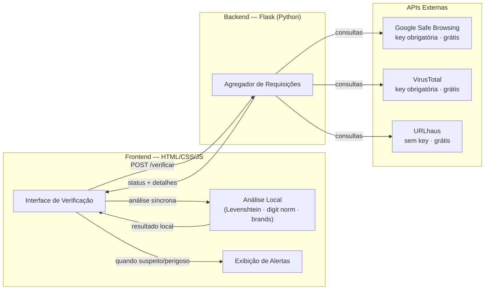

# Phishing Detector

Sistema web para verificação de URLs suspeitas, com análise local no browser e consulta a múltiplas blacklists externas.

---

## Visão Geral



---

## Arquitetura



---

## Dependências Python

| Pacote | Uso |
|---|---|
| `flask` | framework web |
| `requests` | chamadas às APIs externas |

```
pip install flask requests
```

---

## APIs Externas

| API | Endpoint principal | Autenticação |
|---|---|---|
| Google Safe Browsing | `POST /v4/threatMatches:find` | API key (Google Cloud) |
| VirusTotal | `POST /api/v3/urls` + `GET /api/v3/analyses/{id}` | API key (VirusTotal) |
| URLhaus | `POST https://urlhaus-api.abuse.ch/v1/url/` | Sem autenticação |

---

## Variáveis de Ambiente

| Variável | Obrigatória | Descrição |
|---|---|---|
| `GSB_API_KEY` | Não | Chave Google Safe Browsing; sem ela retorna `warn` |
| `VT_API_KEY` | Não | Chave VirusTotal; sem ela retorna `warn` |

---

## Sites para Testar a Detecção

### Seguro — deve retornar badge verde

| URL | Por quê usar |
|---|---|
| `https://www.google.com` | domínio de marca legítima |
| `https://www.nubank.com.br` | banco brasileiro real (testa brand list) |
| `https://www.mercadolivre.com.br` | e-commerce real (testa brand list) |

### Análise local — deve acionar heurísticas JS

A análise local roda no browser e não depende de API keys.

| URL (exemplo fictício) | Heurística acionada | Resultado |
|---|---|---|
| `http://bradesc0.com.br` | dígito `0→o` imita "bradesco" | local → **bad** |
| `http://itau.conta-segura.com` | "itau" no subdomínio, domínio registrado ≠ itau | local → **bad** |
| `http://nubank-suporte.com` | Levenshtein ≤ 1 contra "nubank" | local → **warn** |
| `http://atendimento.bradesco.golpe.com` | "bradesco" no hostname, domínio registrado = `golpe.com` | local → **bad** |

> URLs fictícias — não acesse nem cadastre dados caso existam.

### Blacklists externas — URLs de teste oficiais

> **Requer `GSB_API_KEY` configurada.** Sem a chave, o backend retorna `warn` (suspeito), não `bad` (perigoso).

| URL | Fonte | Resultado com chave |
|---|---|---|
| `http://malware.testing.google.test/testing/malware/` | Google Safe Browsing | GSB → **bad** |

> Apenas a URL de malware é confiável via API. As URLs de phishing e unwanted do GSB (`phishing.testing.google.test`, `unwanted.testing.google.test`) funcionam no browser mas não disparam a API de forma consistente.

> O VirusTotal retorna **erro ao consultar** para domínios `.test` (TLD reservado, não resolve no DNS). Isso é esperado — o resultado aparece como `warn` (suspeito), não compromete a detecção.

### Encontrar URLs reais de phishing (para testes avançados)

| Recurso | Link | Observação |
|---|---|---|
| URLhaus Browse | `https://urlhaus.abuse.ch/browse/` | Lista pública de URLs maliciosas ativas |
| PhishTank | `https://www.phishtank.com/phish_search.php` | Base de phishing verificado pela comunidade |
| OpenPhish | `https://openphish.com/` | Feed público de phishing em tempo real |

> Use com cuidado: são URLs maliciosas reais. Não abra no browser — apenas copie a URL e cole no detector.

---

## Documentação

| Arquivo | Conteúdo |
|---|---|
| `casos-de-uso.md` | Diagramas de casos de uso (UC01–UC05) |
| `design-system.md` | Paleta, tipografia, componentes e wireframes |
